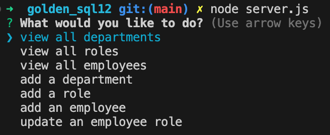

# golden_sql12

## Description
Golden_sql is a project built to create a table for corporations with for employee's. Golden_sql will allow you to view all departments, roles, and employees. It will also ask you if you would like to add a employee, role, and department. After adding this information, you are able to see it when clicking view all department, roles, or employees. This purpose for this project is to enter employee's information in a way where it is organized and easy to access. 
## table of Contents

- [Installation](#installation)
- [Usage](#usage)
- [Questions](#questions)
- [Tests](#tests)
- [Contributing](#contributing)

## Installation

Create a repository using GitHub.\
Clone SSH into computer. \
Install the following into terminal:

- npm i
- postgresSQL: 8.13.1

## Usage

Step 1: open terminal to the correct folder.\
Step 2: Type node server.js and hit enter.\
Step 3: You will be prestented with questions to answer.

## questions

awwad.tala1@yahoo.com

## tests

No tests were conducted.

## contributing

Xpert learning assistant \
Tutor assistant: Joem C.\
Teacher assistant: Zac Warner \
Students: Art Camacho, Thomas White.
